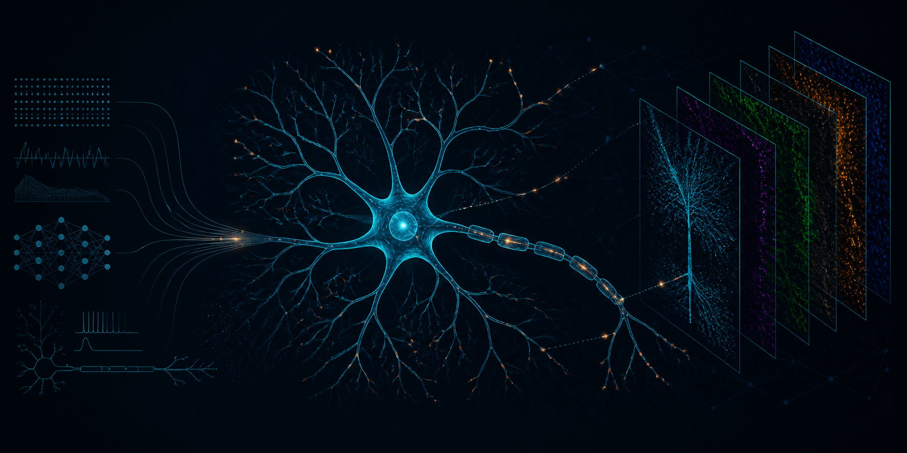

<p align="center">
  
</p>

<h1 align="center">Anthony Moreno-Sanchez</h1>

<p align="center">
  Connectomics · Biophysical Modeling · Research Software · Imaging Analysis
</p>

<p align="center">
  <a href="https://anthonymorenosanchez.github.io/">
    
  </a>
  <a href="https://www.linkedin.com/in/anthony-moreno-sanchez-a53241340/">
    
  </a>
  <a href="https://github.com/AusbornLab">
    
  </a>
</p>

I am a Neuroscience PhD candidate at Drexel University College of Medicine developing reproducible tools for connectomics, neural-circuit modeling, and imaging analysis using Python, MATLAB, and R.

## Selected Research Software

<table>
  <tr>
    <td width="33%" valign="top">
      <h3>VPN-DN Synapse Normalization</h3>
      <p>
        Connectome-based modeling pipeline for synapse mapping, receptive-field analysis, electrophysiology processing, and neuron simulations.
      </p>
      <p>
        
        
        
      </p>
      <p>
        <a href="https://github.com/AusbornLab/VPN-DN-synapse-normalization">View repository →</a>
      </p>
    </td>
    <td width="33%" valign="top">
      <h3>KC NaChBac Model</h3>
      <p>
        Biophysical workflow integrating electrophysiology, neuronal morphology, passive-property fitting, and sodium,and potassium channel simulations.
      </p>
      <p>
        
        
        
      </p>
      <p>
        <a href="https://github.com/AusbornLab/KC_NaChBac_Model">View repository →</a>
      </p>
    </td>
    <td width="33%" valign="top">
      <h3>Napari UI</h3>
      <p>
        Python interface for multi-channel confocal-image visualization, masking, colocalization, cell counting, and intensity analysis.
      </p>
      <p>
        
        
        
      </p>
      <p>
        <a href="https://github.com/AusbornLab/Napari_UI">View repository →</a>
      </p>
    </td>
  </tr>
</table>

## Featured Projects

<p>
  <a href="https://github.com/AusbornLab/VPN-DN-synapse-normalization">
    
  </a>
  <a href="https://github.com/AusbornLab/Napari_UI">
    
  </a>
</p>

## Research Workflow

```mermaid
flowchart LR
    A[Connectome, imaging, and electrophysiology data] --> B[Data processing]
    B --> C[Neuron morphology and synapse mapping]
    C --> D[Biophysical modeling and simulation]
    D --> E[Statistical analysis and visualization]
    E --> F[Reproducible research software]
